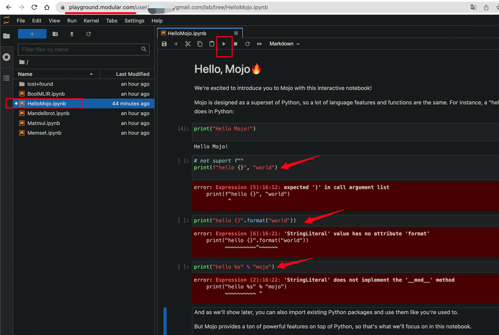
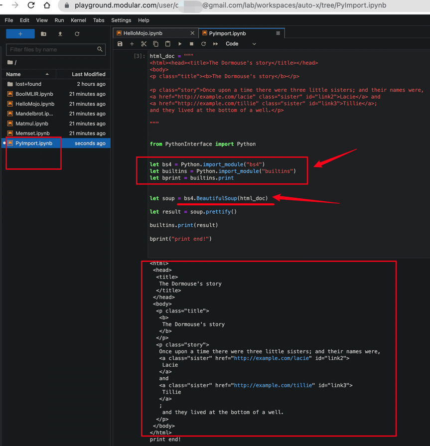

# learn-mojo

learn mojo

## Mojo 是什么?

- 🔥 [Mojo](https://docs.modular.com/mojo/why-mojo.html) = Python++. (类似: `C vs C++`, `JS vs TS`, `ObjectiveC vs Swift`)
- 🔥 迄今, 唯一内置 `自动挡模式(Python Mode) + 手动挡模式(NoGC Mode)` 的编程语言.
- 🔥 100% 兼容 Python: 当前兼容 Python 3.10+
- ✅️ 直接 import Python & Python Libs(Std + 3rd).
- ✅️ 直接 import C & C Std.(与 C 互操作性是 Zig level)
- ✅ 性能: C Level.(同 Rust/Zig/C)
- ✅ 易用性: Python Level.(新增语法设计, 高度符合 Python 直觉)

## [Mojo 101](./packages/mojo101/)

- ✅️ [Mojo 入门学习教程](packages/mojo101)
- ✅️ 包含大量示例代码
- ✅️ 新手建议使用 `pycharm` 打开项目，方便使用 `jupyter notebook`

### [Mojo 官方文档代码](./packages/mojo-manual/):

- 🔥 官方文档: [mojo docs](https://docs.modular.com/mojo/manual/basics.html)

| 代码文件                                                            | 说明        | 备注 |
| ------------------------------------------------------------------- | ----------- | ---- |
| ✅ [01. 开始](packages/mojo-manual/src/mojo_manual/try_01.mojo)     | hello world | 🌟   |
| ✅ [02. 基础](packages/mojo-manual/src/mojo_manual/try_02.mojo)     | 代码        | 🌟   |
| ✅ [02b. 函数](packages/mojo-manual/src/mojo_manual/try_02b.mojo)   | 函数定义    | 🌟   |
| ✅ [02c. 结构体](packages/mojo-manual/src/mojo_manual/try_02c.mojo) | struct 定义 | 🌟🌟 |

### [Mojo 标准库](./packages/mojo-std/):

- 🔥 标准库学习 & 代码.

### Mojo 官方 Examples:

- 🔥 [mojo examples](https://github.com/modularml/mojo/tree/main/examples)

### Mojo 官方 playground:

- ✅️ 在 playground 中测试， mojo 当前不支持的 python 语法（未来可能支持）



- ✅️ Mojo 直接导入 Python 第三方 lib 的能力. 🔥️
  - 以 BeautifulSoup4 解析+格式化 HTML 为示例, Mojo 🔥️ YYDS.



## Development Environment

- ✅️ [go-task](https://taskfile.dev/) + [Taskfile.yml](Taskfile.yml) : 脚本工具，替代 Makefile
- ✅️ [python3.10+](https://www.python.org/downloads/)
- ✅️ [poetry](https://python-poetry.org/docs/)
- ✅️ [jupyter notebook](https://jupyter.org/install)

```bash

# 安装 go-task: https://taskfile.dev/installation/
# install: (only for mac)
brew install go-task
# or: (only for windows)
choco install go-task


# 安装 pyenv + python3.10 + 自动配置 venv
task setup

# 安装依赖包：
task mojo:install

```
